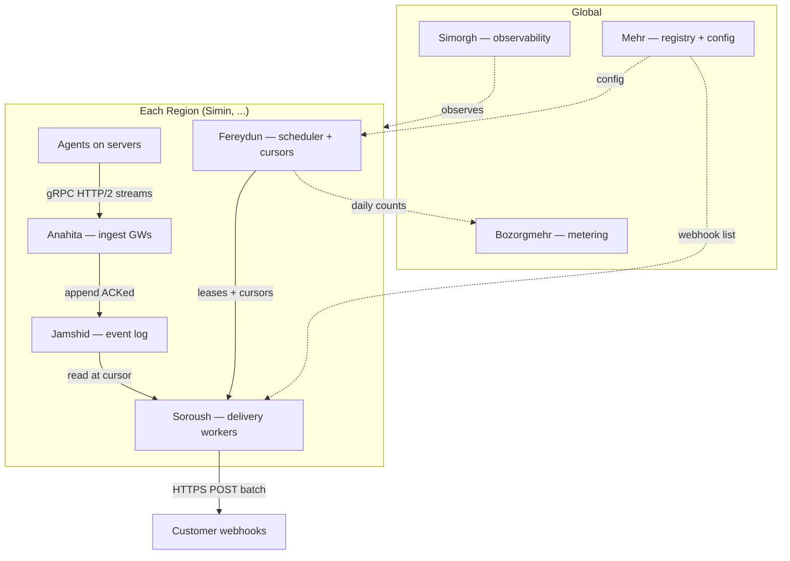

# 1. Problem Context

A cloud provider runs cloud servers across several regions. Large customers want their servers' events and logs pushed to them in near real time, delivered to webhook endpoints they register. An agent on each server emits events as JSON, each tagged with a customer id. The system has to accept that firehose, hold it durably for a bounded window, and fan it out to each customer's webhook(s) reliably, in order, and at a rate each endpoint can actually absorb.

## 1.2 Abstract

Ingesting events from agents and holding them durably for 30 days; per-customer, per-webhook delivery with at-least-once and per-source ordering; backpressure and isolation across tenants and across a tenant's own webhooks; a measurable monthly event count per customer; and multi-region operation.

## 1.3 Solution Methodology

To provide a solution for this system, I emphasized on Non-Functional requirements over functional ones. I tried to make realistic assumptions based on domains I had experienced in, so there may exist some un-realsitic assumptions in 1.3 or even un-seen parts.

This document is generated mostly with AI, through 3 design sessions I had in two days as a ONE shot solution to requested problem statement. I don't expect it to be deep or fully alighen with real world details.

## 1.4 Assumptions

Every system should be designed upon functional and non-functional requirements. There are plenty of un-answered questions I would ask to understand requirements deeper, but I've committed to a default and stated why.

Basically I started from around 50k customers with 100% YoY. I don't know average server nodes/customer, but taken it would be around millions of servers, taken magninute of log/server, I sized for 5 billion of logs daily which I assume is a high upper limit.

This leads to 25k log/sec across all regions with a 300k pick time burst in mind. I chose 1KB payload size for each event.

Webhooks are also assumed per customer not per customer per region.

I also asummed we only provide daily/monthly aggregated counts of delivery status not delivery logs, otherwise we should also design another log stream system for delivery status logs (taken out of scope)

These assumptions are generally self-answers to my questions to clarify system dimentions for the solution provided afterwards.

| Assumption     | Default                                                      | Why it matters                                               |
| -------------- | ------------------------------------------------------------ | ------------------------------------------------------------ |
| Latency target | p99 ≤ 5s, event creation → first delivery attempt            | Decides streaming vs. batch. We own time-to-first-attempt, not the customer's ack latency. |
| Peak volume    | ~300k events/sec (5B/day avg, ~4× peak)                      | Sizes ingest, partition count, and the broker tier.          |
| Event size     | ~1 KB JSON avg → ~150 TB resident at 30 days (pre-replication) | Sizes storage and cost.                                      |
| Data residency | Events stay in origin region; but customer webhook config and cursor metadata is global | Forces regional ingest + delivery; avoids costly cross-region ordering. |
| Tenant skew    | Top ~1% of tenants ≈ 50% of volume; long tail of tiny tenants | Drives the tiering and fair-scheduling design.               |
| Scale & growth | ~50k tenants, 100% YoY → design for 100k+ within a year      | Sizes the control plane and partition headroom.              |
| Retention      | 30 days, then hard delete                                    | Given; also the safety valve for slow consumers.             |

## 1.5 Functional requirements

1. Accept JSON events from agents, each carrying a customer id, across multiple regions.
2. Persist every accepted event durably for 30 days, then delete it.
3. Let a customer register one or more webhook endpoints.
4. Deliver every event to each of a customer's webhooks at least once.
5. Preserve per-source ordering on every webhook stream.
6. Let the customer configure how many events arrive per webhook request (batch size).
7. Apply identical delivery behavior across all of a customer's webhooks.
8. Expose a measurable count of events per customer per calendar month.

## 1.6 Non-functional requirements

| Property     | Target                                                       |
| ------------ | ------------------------------------------------------------ |
| Throughput   | ~300k events/sec peak, headroom to 2×                        |
| Latency      | p99 ≤ 5s, event creation → first delivery attempt            |
| Durability   | No loss of an accepted event within its 30-day window        |
| Ordering     | Per-source guaranteed; cross-source best-effort              |
| Availability | Ingest is the highest-priority path; it must keep accepting writes even when delivery is degraded |
| Isolation    | No tenant or webhook can starve another (noisy-neighbor safe) |

# 2. High-Level Architecture

The system is designed as a pipeline. Events flow in from the agents to ingestion gateways which then rest in a durable partitioned log stream, and finally are carried out to each customer's webhooks. Events remain in the region that produced them, so the whole data path — ingestion, the log, and delivery — is regional, and a deployment in each region is a self-contained copy of the pipeline. And because ingestion has to keep accepting writes even when delivery is unhealthy, the log sits in the middle as a buffer that lets the two halves fail and recover on their own schedules. Only two things are truly global: the registry of who owns which webhook, and the rollup that produces a single daily/monthly count per customer across all regions.

I asked AI to name each component after a figure from Persian mythology whose role mirrors its job. :)



## 2.1 Anahita (the waters where all streams converge) — ingestion

Anahita is the front door. It receives the firehose from hundreds of thousands of agents over streaming gRPC sitting behind a load balancer, validates each event, stamps it with its region and an ingest timestamp, and appends it to the regional log. It deliberately holds nothing durably itself — it is a thin, fully stateless, fast pass-through component.

Because it is stateless, it scales horizontally by adding instances behind the balancer, sized by the number of agent connections and the ingest throughput rather than by any stored state. Resiliency in this layer is supported by supporting backpressure when log service (Jamshid) is failing. Log failover is absorbed by a small local on disk buffer on agents. When a sustained log outage happens: Anahita stops acknowledging writes and lets the durability burden fall back onto the agents' on-disk spool. The issue that matters most here is recovery: when Anahita comes back, it admits traffic on a slow ramp and the agents reconnect with jittered backoff, so the instant the door reopens it is not trampled by every agent in the region arriving at once.

## 2.2 Jamshid (the vault that preserves through winter) — the durable event log

Jamshid is the system of record and the replay buffer in one. Every accepted event is appended here, but the number of physical partitions is fixed — a few thousand per region — and an event's partition is chosen by a key rather than by creating a partition per source. That key is adaptive by tenant tier: a normal customer is keyed by `customerId`, so all of their events land on a single partition and their webhook reads from just that one; a BIG customer is keyed by `customerId` plus a bounded bucket, may be `hash(serverId) % K`, which spreads their load across K partitions while keeping each server's events ordered within its bucket. This keeps BIg cusomers off any single hot partition without scattering a customer across thousands of them, and it preserves the guarantee that matters — per-source ordering — while leaving cross-source order best-effort. Events are kept for thirty days and then deleted.

Jamshid is more than a pipe between ingestion and delivery; it is the part of the system that allows every other part to fail in isolation. Because each accepted event is written here durably and held for thirty days, the delivery side can fall hours behind, or go down entirely, without a moment of that pressure reaching the agents. A slow customer endpoint never backs up into ingestion — it simply means that webhook's cursor sits further behind inside the vault, while events continue to age out normally at the thirty-day boundary. This is why we treat the log as the system's shock absorber: it turns a chain of tightly-coupled services into a set of independently-recoverable ones, each reading and writing at its own pace.

For its own availability, Jamshid runs as a replicated cluster (replication factor three), so the loss of a node is invisible to the rest of the system. It scales by adding brokers and partitions as volume grows, and the bulk of the thirty-day retention is offloaded to cheaper object storage rather than sitting entirely on hot disk — which is what keeps a hundred and fifty terabytes of resident data economically sane.

## 2.3 Mehr (keeper of every covenant) — global registry and config

Mehr is the single source of truth for tenants and their webhooks: the registered endpoints, their secrets, the configured batch size, and the rest of each webhook's configuration. The regional delivery side reads it constantly and writes to it rarely.

It is one of the only two genuinely global components, and that is a deliberate choice rather than an oversight. A customer is a single entity whose webhooks apply to events from any region; if the registry were regional, we would have to synchronize webhook definitions across regions anyway, which would rebuild a global store with extra moving parts and extra ways to drift out of sync. Being read-mostly, Mehr replicates cheaply — each region reads a local replica, while writes go through one authoritative store — so its availability can be high without its load ever being heavy.

## 2.4 Fereydun (who divided the realm fairly) — scheduler and cursors

Fereydun is the regional hot state and the brain of delivery within a region. It holds where each webhook's cursor stands, leases units of work — a `(webhook, partition)` pair — to the delivery fleet, and schedules that work fairly so that no tenant, and especially no heavy tenant, can starve the others. This is where tiering lives in practice: the long tail of small tenants shares pooled capacity, while the handful of whales that produce most of the volume are given dedicated shards so their bulk never crowds out everyone else.

This state is regional because cursors advance continuously and are bound to regional partitions; putting any of it behind a global coordinator would drag cross-region latency into the hot path for no benefit. Its own state is persisted, so a scheduler restart resumes from the last committed cursors rather than from zero, and the role is replicated for failover. It scales with the number of webhooks and partitions a region has to coordinate.

## 2.5 Soroush (the divine messenger) — delivery workers

Soroush performs the actual delivery. A worker leases a `(webhook, partition)` from Fereydun, reads from Jamshid at the current cursor, assembles a batch up to the customer's configured size, signs it, and sends it to the endpoint. It advances the cursor only after the customer acknowledges the batch — and that single rule is what gives at-least-once delivery and per-source ordering at the same time. On a failed delivery it retries with backoff; after repeated failures it trips a circuit breaker for that endpoint and moves on, while the undelivered events keep aging safely inside Jamshid until either the endpoint recovers or the thirty days run out.

The consumer is per webhook, not per customer. Each webhook is an independent reader with its own cursor over the customer's partitions, so a customer's webhooks make progress independently and a slow one can never hold back the others — which provides identical behavior across webhooks. Soroush is stateless, since all progress lives in Fereydun and Jamshid, so the fleet scales horizontally and a lost worker simply has its lease reassigned. Per-webhook adaptive concurrency lets a fast endpoint be driven harder and a slow one be eased off, each in isolation.

## 2.6 Bozorgmehr (the sage who reckoned the grains) — metering

Bozorgmehr counts what was delivered acting like a distributed counter. The requirement is only a measurable monthly count per customer, so rather than ship a status record for every delivery, the count is derived from the cursor commits Fereydun already makes: when a batch is acknowledged and its cursor checkpoint commits, the number of events delivered in that batch is added — in the same atomic step — to a per-customer daily counter in that region. Because the cursor advances exactly once per event regardless of how many times a batch was physically re-sent, this yields clean unique-events-delivered counts with no deduplication machinery, and it is exactly as crash-safe as the cursor itself: a worker that dies mid-batch re-delivers and advances once on recovery, never double-counting.

Bozorgmehr periodically sums each region's daily counters into one small daily table per customer, which rolls up to the daily/monthly figure. Whether the figure means unique events per customer or total deliveries across a customer's webhooks is a definition the brief leaves open; both fall out of the same counters — the first counted once per event, the second summed across the customer's webhooks — so the mechanism does not change either way. We deliberately do not retain a record per delivery: that would only be needed for billing-audit or dispute resolution, which is out of scope, and it is the one thing we would add back if such a requirement appeared.

## 2.7 Simorgh (the bird that sees all) — observability

Simorgh is the system-wide view. It watches per-tenant lag, delivery success rates, latency percentiles measured against the SLA, and the health of every endpoint, across every region. No customer asked for it, but the isolation and latency guarantees are unenforceable without it: you cannot stop a noisy tenant from starving its neighbours if you cannot see that it is happening. It is a global aggregation over regional metrics, and the one thing to watch in its own design is cardinality — per-customer series across a hundred thousand–plus tenants will overwhelm a naive metrics store, so series are pre-aggregated by tenant tier and only drilled down to a single customer on demand.

## 2.8 System backpressure

Backpressure runs along the whole pipeline where Jamshid is the universal shock absorber. Pressure on the delivery side never propagates back to ingestion, because the log decouples them and the thirty-day retention is the buffer — a slow webhook's backlog ages quietly in the vault, isolated to that one webhook. The only backpressure that ever reaches the agents is when ingestion itself cannot keep up, which is a capacity problem rather than a delivery one.

Link by link: between the agents and Anahita, gRPC flow control plus the agent's on-disk spool and jittered backoff hold the line. Between Anahita and Jamshid, a small buffer covers brief blips and backpressure to the agent covers a sustained outage. Between Jamshid and Soroush there is no push at all — workers pull at their own pace, so a backed-up delivery fleet never disturbs the writers. Between Soroush and the customer, adaptive concurrency and circuit breakers absorb a slow or failing endpoint, with the backlog bounded by retention rather than by memory. And metering adds no link to this chain at all: the count rides the cursor commit, so there is no separate stream between delivery and Bozorgmehr to back up — the global merge reads regional counters on its own schedule, and a lag there costs only reporting freshness, never delivery. At no point does one struggling link force the link upstream of it to drop data.


# 3. Capacity Estimation

Every figure here is derived from the Section 1 assumptions, and for each one the input and the binding constraint are shown — because at this scale the number that matters is rarely the obvious one. Ingestion turns out to be bound by throughput rather than connection count, the log by partition distribution rather than raw write speed, delivery by concurrency rather than CPU, and metering by how aggressively we pre-aggregate rather than by raw volume.

## 3.1 Base traffic

The volume figure is the most definition-sensitive input, so we treat it as a deliberate **conservative design envelope** rather than a prediction: with events defined as discrete structured occurrences (Section 1), the realistic steady-state is likely lower — hundreds of millions to ~1–2B/day — but we size to 5B/day so the architecture absorbs bursts, a broader reading of "event," and a couple of years of the 100% growth.

Five billion events per day averages to 5,000,000,000 ÷ 86,400 ≈ **58k events/sec**. The peak runs about four times the average once you account for daily cycles and the fact that regions and customers do not light up uniformly, which lands near 230k/sec, so we design ingestion for **~300k events/sec** to keep headroom. At roughly 1 KB per event that is **~300 MB/sec** of write at peak and ~58 MB/sec on average. Daily volume is ~5 TB raw, and across the thirty-day window ~**150 TB resident** before replication.

For the per-component sizing we assume **four regions, unevenly loaded**, and size each region against the largest, treated as ~40% of global traffic — about **120k/sec** and ~60 TB resident. Global totals are what the summary reports; per-region sizing follows the busiest region so the design is never underbuilt where it is most loaded.

## 3.2 Anahita — ingestion

There are two things to size: how much throughput each instance sustains, and how many agent connections it must hold.

On **throughput**, a gRPC service that only deserializes, validates, and appends sustains on the order of ~25k events/sec per instance as a conservative planning figure. For 300k/sec that is 300k ÷ 25k = **12 instances**. On **connections**, hundreds of thousands of agents sit on persistent streams; at ~50k streams per instance that is 300k ÷ 50k = 6 instances. Throughput is the larger of the two, so it binds. With N+2 redundancy for instance loss and rolling deploys, plan **~16–20 instances globally**; the largest region needs 120k ÷ 25k ≈ 5, call it ~7 with redundancy. Memory is a non-issue — a few tens of KB of stream state, roughly 15 GB across the whole fleet for 300k streams.

The reason throughput binds rather than request rate is that agents batch: a few hundred events ride in each request, so Anahita's real load is bytes and batch-unpacking, not the number of requests arriving.

## 3.3 Jamshid — the event log

**Storage** is split into a hot tier and a cold tier. Keep about 24 hours hot on NVMe so that a lagging consumer can still read locally: 24 hours of average traffic is ~5 TB raw, times three for replication, ≈ **15 TB of NVMe** globally. The remaining ~150 TB of the thirty-day window lives in **object storage as a single logical copy** (the object store provides its own durability), which is cheap. The split is the whole cost argument: without tiering you would carry 150 TB × 3 = 450 TB on hot disk; tiering turns that into ~15 TB of NVMe plus ~150 TB of object storage.

**Partitions.** The physical partition count is fixed — not one per source, which would be unmanageable — so choose **~4,000 partitions per region** (~16,000 across four). An event's partition is chosen by an adaptive key rather than by creating partitions per server: a normal customer is keyed by `customerId` and lands on a single partition, while a BIG customer is keyed by `customerId` plus a bounded bucket `hash(serverId) % K` that spreads them across K partitions, sized to their volume, without scattering them across all 4,000. This preserves per-source ordering — a given server always resolves to the same partition or bucket — while keeping BIG customers off any single hot partition. With ~100k customers over ~4,000 partitions, small customers share a partition (a couple dozen each), so their webhook filters to its own `customerId` on read; that read amplification is cheap because these are low-volume partitions, and BIG ones avoid it through their dedicated buckets. The count itself is not set by write throughput — 120 MB/sec in the largest region over a conservative ~10 MB/sec-per-partition floor needs only about twelve partitions — but by key distribution for BIG customers and consumer parallelism for the delivery fleet. At ~2 MB of memory per partition replica, 4,000 × 3 ≈ 24 GB of cluster memory per region is comfortable, and the average per-partition load of 120 MB/sec ÷ 4,000 ≈ 30 KB/sec leaves large headroom for hot keys.

**Broker nodes** are bound by quorum, redundancy, and partition distribution rather than by capacity. Plan ~5 brokers in the largest region — quorum-friendly, holding the partitions and the region's ~6 TB hot tier while surviving N+2 — and fewer in smaller regions, for **~16–20 brokers globally**.

## 3.4 Soroush — delivery, and the fan-out cost

The multiplier comes first: each event goes to each of a customer's webhooks. With an average of ~2 webhooks per customer, delivery operates on **~600k events/sec** at peak — twice the ingest rate. That same factor of two is the **read amplification** on Jamshid, since each webhook reads its partitions independently, so the log is read about twice for every write. For caught-up webhooks those reads come from the broker's cache cheaply; the expensive reads are the cold ones, where a lagging webhook pulls old data from object storage — which is precisely why slow consumers cost more and why we cap them.

The number that actually sizes the fleet is concurrency, not CPU, and the tool is **Little's law**: concurrent in-flight = throughput × latency. Batched at ~100 events per POST, 600k events/sec is ~6,000 POSTs/sec; at a healthy 200 ms round-trip that is 6,000 × 0.2 = **~1,200 outbound requests in flight** on the happy path. The real provisioning, though, is for the tail: when many endpoints are slow (a 2-second round-trip), in-flight requests pile up, so we cap in-flight per webhook at a few outstanding POSTs each via adaptive concurrency, and size the fleet to hold tens of thousands of concurrent requests across all workers. Because a worker is an async non-blocking I/O multiplexer holding thousands of requests at once, that comes to only a handful of instances on the happy path, rounded up to **~10–20 globally** for the slow-endpoint tail, redundancy, and per-region presence. Outbound bandwidth is ~600 MB/sec at peak.

## 3.5 Fereydun — scheduler and cursors

State is one cursor per `(webhook, partition)` actually consumed. With ~100k tenants at ~2 webhooks each, that is ~200k webhooks; small tenants touch one or a few partitions while BIG customers touch many, so the cursor count is **on the order of a million** globally. Each cursor is ~100 bytes, so the data is ~100 MB — tiny — but the write rate is real: every acknowledged batch advances a cursor, ~6,000 writes/sec globally, which a fast key-value store handles without strain. The scheduling itself — assigning leases, enforcing fairness — is event-driven and light, so Fereydun is a **small, replicated fleet per region**, sized by the number of webhooks and partitions it coordinates rather than by throughput.

## 3.6 Bozorgmehr — metering

Because the count is derived from cursor commits rather than from a record per delivery, there is almost nothing to size here. Each region keeps per-customer daily counters incremented at cursor-commit time — at ~100k customers that is ~100k counters per day per region, a few megabytes of state — and the write traffic piggybacks on the cursor commits Fereydun is already doing (~6,000/sec) rather than adding a 600k-record/sec stream. Bozorgmehr's global merge runs periodically — say hourly — summing each region's daily counters into one small daily table per customer; at ~100k customers across a handful of regions that is on the order of a million rows per day before rollup, which any ordinary replicated relational store holds comfortably. There is no columnar firehose and no OLAP cluster on this path: the 600k-records/sec stream and its multi-terabyte raw storage simply do not exist in this design. They reappear only if a billing-audit requirement later forces us to retain a record per delivery.

## 3.7 Headroom and growth (100% per year)

Every component scales horizontally: more Anahita and Soroush instances, more Jamshid brokers and partitions, and a metering table that grows only with the customer count, while the cold tier grows by object-storage spend rather than by redesign. The partition count is chosen with enough headroom that doubling volume does not force a reshuffle for a couple of years. Doubling the traffic is a procurement exercise, not an architectural one — which is the dividend of decoupling the stages through the log.

# 4. Design Contracts & Non-Functional Guarantees

This section stops describing components and defends the mechanisms a reviewer will actually probe — the delivery contract, the at-least-once and ordering guarantees, fairness under skew, and slow-consumer handling — and then treats the non-functional properties (backpressure, availability and recovery, scalability) at the system level rather than per component. Where Section 2 stated a guarantee in a sentence, here we show why it holds and, just as importantly, where it stops.

## 4.1 The delivery contract

A delivery is an HTTPS POST of a batch to the customer's registered URL. The batch is an envelope — an array of events plus a little metadata — and each event carries a stable, globally-unique `event_id` (the basis for the customer's deduplication), a `source_id` and a per-source `sequence` number that increases monotonically for that server, the `customer_id`, an event `type`, an `occurred_at` timestamp, and the structured `payload` the agent produced.

```json
{
  "batch_id": "b_01HQ7M…",
  "customer_id": "cust_8421",
  "count": 3,
  "events": [
    {
      "event_id": "evt_01HQ7M3…",
      "customer_id": "cust_8421",
      "source_id": "srv_55",
      "sequence": 11920,
      "type": "server.scaled",
      "occurred_at": "2026-06-06T10:02:11Z",
      "payload": { "…": "agent JSON" }
    }
  ]
}
```

For any given `source_id`, the `sequence` numbers are strictly increasing within and across batches — that is the per-source ordering guarantee made concrete, and it lets a customer detect that they have a continuous, ordered stream per server. Events from different sources may interleave inside a batch; that interleaving is the best-effort cross-source order, and the contract makes no promise about it.

The customer acknowledges by returning a 2xx for the whole batch. Anything else — a non-2xx status or a timeout — is treated as a failure of the entire batch and triggers a retry. Acknowledgement is all-or-nothing on purpose: partial acks would force us to re-send individual events out of their original position, which breaks the per-source ordering we promise, so the batch is the unit of both delivery and acknowledgement. The batch size — how many events ride in one POST — is the customer-configurable knob from the requirements, and it is the main lever a customer has to trade request overhead against per-request size.

## 4.2 At-least-once, ordering, and idempotency

The entire delivery guarantee rests on one rule: Soroush advances a cursor only after the customer has acknowledged the batch read at that cursor. From that single rule both properties follow. We never skip past an unacknowledged batch, so nothing is lost — that is the *at-least* half. And because the cursor only moves on confirmation, a successful POST whose acknowledgement is lost in the network leaves the cursor where it was, so the batch is sent again — that is the *once-or-more* half. There is no path that delivers at-most-once, and that is deliberate: losing an event is a worse failure than delivering it twice.

Duplicates therefore happen, in exactly two situations: a lost acknowledgement after a successful POST, and a worker that crashes after the POST but before the cursor commit, so that the replacement worker re-reads from the last committed position. Both produce a redelivery, and both are handled the same way — the customer deduplicates by `event_id`.

Ordering carries a cost worth naming. To keep a source's events in order, a cursor sends one batch and waits for its acknowledgement before sending the next — delivery on a single cursor is serialized. That caps a single cursor's throughput at roughly one batch per round-trip, so all the parallelism comes from having *many* cursors: BIG customer spread across K buckets has K cursors running at once, and the long tail of small customers each have their own. A single source that genuinely exceeded one batch per round-trip would be the only thing this serialization constrains, and for discrete events that ceiling is high enough not to matter. (A bounded in-flight pipeline per cursor could raise it, at the price of more complex in-order retry handling; we default to the simple strict form.)

## 4.3 Fairness and tiering under skew

The heavy skew — a few BIG customers producing roughly half the volume against a long tail of tiny tenants — is the condition under which a naive design collapses, because one tenant's backlog consumes the shared worker pool and everyone else's latency suffers. Three mechanisms, layered, keep that from happening.

The first is structural: **tiering**. Tenants are classified by observed volume. The long tail keys by `customerId`, shares partitions, and draws from a shared worker pool; BIG ones key by `customerId` plus a bounded bucket, get their own partition shards, and are scheduled against dedicated capacity. Separating the heavy tenants structurally is the single most effective move, because it means aBIG cusomer's bulk is contended for mostly against itself.

The second is dynamic: Fereydun schedules worker leases by **weighted fair queuing** rather than first-come-first-served, so a tenant with a large backlog receives worker time in proportion to its weight, not in proportion to how much work it has waiting. A backed-up BIG customer cannot monopolize the fleet and push thousands of small tenants behind it. The third is a hard floor: **per-tenant quotas** cap the in-flight work any single tenant can hold at once, so even a misbehaving tenant has a ceiling.

Promoting a tenant from the shared tier into its own shards is a real operation, not a free relabel — it changes which partitions the tenant's events land in, so it is done as a controlled migration at a partition boundary to avoid reordering across the change, and it happens rarely, driven by Simorgh's volume observations. Underneath all of this, the log is doing quiet work too: because each webhook has its own cursor and Jamshid decouples ingest from delivery, a BIG customer backlog simply ages in the vault and never touches anyone else's delivery path. Fairness scheduling only has to allocate *worker time* fairly; it never has to protect the log itself.

## 4.4 Slow and failing consumers

Customer endpoints are not uniform — some absorb thousands of events a second, some are a single slow process — and the system has to serve both without letting the slow ones degrade the fast ones. Each webhook is driven by **adaptive concurrency**: the number of in-flight requests to an endpoint ramps up while its latency and error rate stay healthy and backs off sharply when they degrade, which is essentially congestion control applied to delivery. When an endpoint fails repeatedly, a **circuit breaker** trips for it — Soroush stops hammering a dead endpoint, probes it periodically, and resumes when it recovers, which protects both the customer's endpoint and our own worker capacity from being spent on certain failure.

A **per-webhook in-flight cap** bounds how many concurrent requests one webhook can occupy, so a slow webhook cannot quietly accumulate worker slots — this is the same boundary that makes the fairness story hold. And the ultimate safety valve is that a slow or failed webhook's undelivered events do not pile up in memory; they age in Jamshid, bounded by the thirty-day retention. The backlog has somewhere to live that is not RAM, which is why a slow consumer produces *lag* rather than *pressure*. The customer sees that lag through the observability surface, and when their endpoint recovers, delivery resumes from the cursor and catches up — reading the older events from the cold tier — until it is current again. The configurable batch size is the customer's own lever here: small batches for a fragile endpoint, large batches for a fast one.

## 4.5 Backpressure, end to end

Backpressure is not a property of any one component; it is a property of the chain, and the organizing idea is that Jamshid is the universal shock absorber — pressure on the delivery side is never allowed to travel back to ingestion. Walking the chain link by link makes clear what saturates and what gives. We already described how link by link backpressure is enforced in 2.8.

The result is a single clean statement: the only backpressure that can ever reach a customer's agents is genuine exhaustion of ingest capacity — a sizing problem we control — and never a delivery-side problem, no matter how slow or broken a customer's endpoint is.

## 4.6 Availability and failure recovery

Availability is best argued through the failures the system is expected to survive, so here are the scenarios that matter.

**A broker fails mid-write.** Jamshid runs at replication factor three, so a single broker's loss is invisible: leadership fails over within the cluster, and Anahita retries the append. Appends are idempotent (a producer id and sequence prevent a retry from duplicating in the log), so the retry is safe and the only visible effect is a brief latency blip.

**An entire region's log goes down.** This is the rare case the edges are built for. Anahita stops acknowledging, agents spool to disk, and when the log returns, Anahita admits traffic on a slow ramp while agents reconnect with jittered backoff — so recovery does not become a second outage. Delivery resumes from wherever each cursor was, and the spooled events drain in. Nothing is lost inside the retention window.

**A delivery worker dies.** Soroush is stateless; all progress lives in Fereydun and Jamshid. The dead worker's lease expires and is reassigned, and the replacement resumes from the last committed cursor. The only consequence is a possible redelivery of one in-flight batch — a duplicate the customer already deduplicates — with no loss and no stall beyond the lease-reassignment interval.

**The scheduler fails over.** Fereydun's state — cursors and the daily counters that commit alongside them — is persisted and replicated, so a standby takes over from the last committed point. During the brief failover, in-flight deliveries complete but new progress cannot be committed; once a new leader is up, progress resumes, and because counters move with cursors they are never left inconsistent.

**A region is lost entirely.** Residency means that region's events are not replicated elsewhere, so they are unavailable until it recovers — a deliberate tradeoff. But the blast radius is exactly one region: a customer with servers elsewhere keeps receiving those regions' events on the same webhook, and the lost region's delivery resumes on recovery.

**Rolling deploys of multiple versions.** This is the operability requirement, and it falls out of the same statelessness. A worker is drained — it finishes in-flight batches and releases its leases — before it is replaced, so the new version picks the leases up cleanly. Duplicate storms are avoided by graceful lease handoff (a lease is not reassigned until released or expired) and by stable partition assignment (a deploy does not reshuffle every lease at once); any redelivery that does slip through a handoff is just a deduplicated duplicate. Old and new versions coexist safely because the delivery contract — payload shape and ack semantics — is stable across them.

## 4.7 Horizontal scalability and growth

Every tier scales by adding instances, and each has one clear binding limit. Anahita is stateless and scales linearly behind the balancer, bound by per-instance throughput. Soroush is stateless and scales linearly, bound by concurrency (Little's law) and outbound bandwidth rather than CPU. Fereydun scales with the number of webhooks and partitions it coordinates; its cursor-and-counter write rate is modest and its state small, so it grows by adding replicas. Bozorgmehr grows only with the customer count, which is to say almost not at all. Jamshid scales by adding brokers and partitions, with the hot tier following node count and the cold tier following object-storage spend.

The one operation that is not free is changing Jamshid's partition count or promoting more tenants into their own shards — both are controlled migrations rather than the addition of a node — so the partition count is chosen with enough headroom that the 100%-per-year growth does not force a reshuffle for a couple of years. Combined with the fact that the volume target is already a conservative envelope (Section 3), this means doubling traffic is, in the normal case, a procurement exercise: more nodes inside the same architecture, with no part of the design needing to be rethought. That property — that growth is bought rather than re-engineered — is the whole point of decoupling the stages through the log.

# 5. Technology Choices

The guiding split is to **buy the commodity primitives and build the multi-tenant delivery orchestration**. Nothing off the shelf does ordered, at-least-once, multi-tenant webhook fan-out with per-tenant fairness at this scale, so that logic is ours; everything beneath it is established open source.

- **Jamshid (the log)** is the one real fork. If we want to go open-source, the default is **Redpanda** for the hot tier — Kafka-compatible, no JVM or ZooKeeper, low tail latency, operationally simple — with **tiered storage to object storage** carrying the thirty-day retention so 150 TB does not sit on NVMe. The strong alternative is **AutoMQ** (S3-backed, Kafka-compatible, open source), which makes long retention cheap and rebalancing trivial if those dominate; **Pulsar** is the choice only if its native multi-tenancy and subscription model are worth taking on BookKeeper's operational cost. The deciding input is the team's operational maturity, not a benchmark. If we want to build it, It should be a zero-copy streaming WAL based append only persistency may be written by Rust or Go or Erlang.
- **Anahita (ingest)** is a custom, stateless gRPC service behind an L4/L7 balancer (Envoy or a cloud LB) — light validation and append, nothing more.
- **Fereydun (scheduler and cursors)** is custom scheduling and fairness logic over a durable, fast, replicated store for cursors and counters (Riak, Memcached, Redis or a Raft-backed store).
- **Soroush (delivery workers)** is a custom stateless worker fleet, written in an non-blocking async runtime (Go or Rust or Nodejs) to hold large in-flight concurrency cheaply.
- **Mehr (registry and config)** is a globally-replicated, read-mostly store — Postgres with regional read replicas, or a dedicated config store. 
- **Bozorgmehr (metering)** is just counters in Fereydun's store plus a small replicated Postgres for the global daily table. No OLAP cluster. We ommitted needs of an OLAP store like Clickhouse by assumptions we made for simplicity, Otherwise implementation a time-series database also may have raised.
- **Simorgh (observability)** is a Prometheus-family stack with a cardinality-aware long-term store (VictoriaMetrics or Mimir), pre-aggregated by tenant tier.

Two notes. **Svix** (open-source webhook delivery) is worth studying as a reference for the delivery engine, though it would need heavy adaptation for this fairness and scale. And the largest volume lever lives at the source: the agent (out of scope here) could use **eBPF** for low-overhead capture and in-kernel filtering or sampling, shrinking the input before it ever reaches Anahita.

# 6. Multi-Region Topology

The whole data path is regional and the control surface is mostly global, and that division is the spine of the design. **Anahita, Jamshid, Fereydun, and Soroush exist as an independent copy in every region**, because events must stay in the region that produced them. The **global plane is only Mehr** (config, replicated read-mostly), **Bozorgmehr's merge** (summing regional daily counters), and **Simorgh's view**.

A customer with servers in several regions has each region's Soroush independently delivering that region's events to the same webhook URL. The webhook therefore receives everything, per-source order holds within each server's stream, and cross-region order is best-effort — exactly the guarantee from Section 1. The cost of full regional independence is that **per-webhook delivery control is per-region**: adaptive concurrency and circuit breakers run separately in each region, so a customer's endpoint sees the sum of all regions hitting it. For the rare customer who needs a strict *global* cap on their endpoint, a small shared token bucket per webhook provides it — and even then Soroush and Fereydun stay regional; only the rate-limit primitive is shared. A whole-region loss is a bounded blast radius: that region's events wait for recovery while every other region keeps delivering.

# 7. Observability & Operations

Simorgh watches what the guarantees depend on: **per-tenant lag** (how far each webhook's cursor trails head), **delivery success rate**, **latency percentiles against the ≤5s SLA** (measured creation-to-first-attempt), **endpoint health**, and **per-region throughput and backpressure**. The non-obvious design constraint is **cardinality** — per-customer time series across 100k+ tenants would crush a naive metrics store — so series are pre-aggregated by tenant tier and only drilled down to a single customer on demand.

The same lag signal is worth exposing **to customers**, so a slow consumer can see *why* it is behind rather than opening a ticket. Operationally, the alerts that matter are lag growth on a tier, circuit breakers tripping in bulk (a sign of a widespread endpoint or network problem), ingest backpressure actually reaching agents (a capacity signal, since delivery problems never should), and region health. Rolling multi-version deploys are handled as described in Section 4.6 — drain, graceful lease handoff, stable assignment — and Simorgh is what confirms a deploy did not introduce a duplicate storm or a delivery stall.
